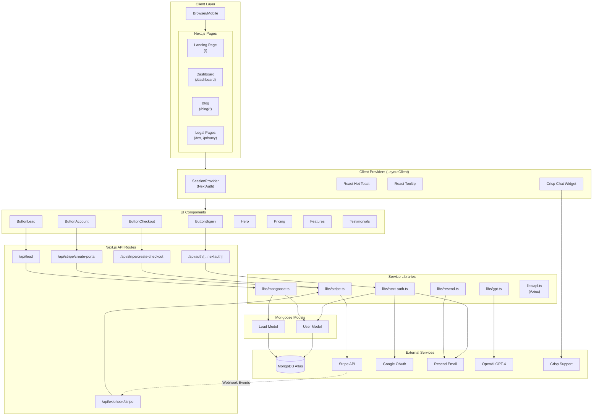
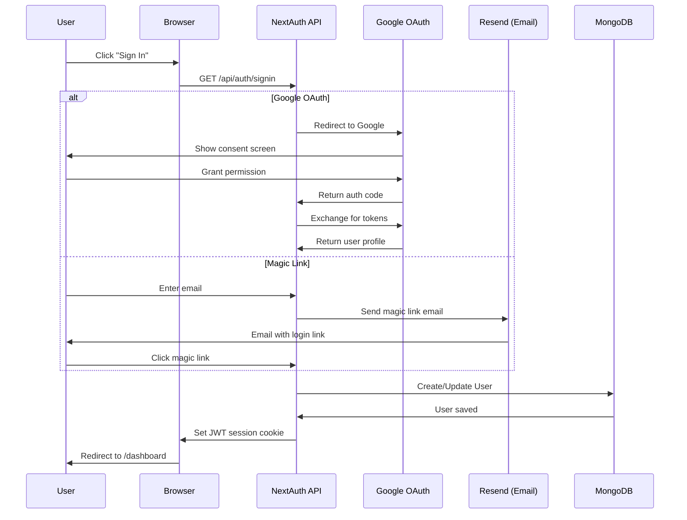
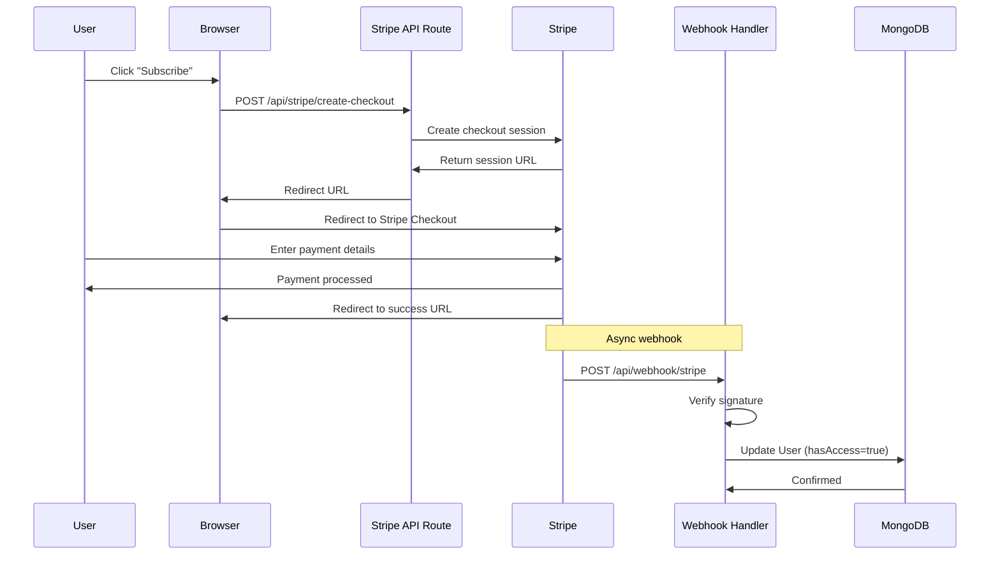
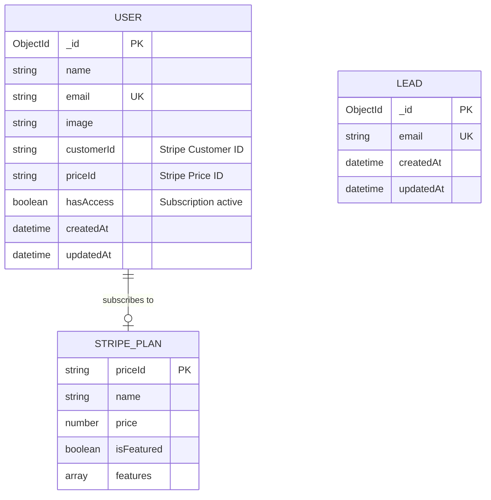
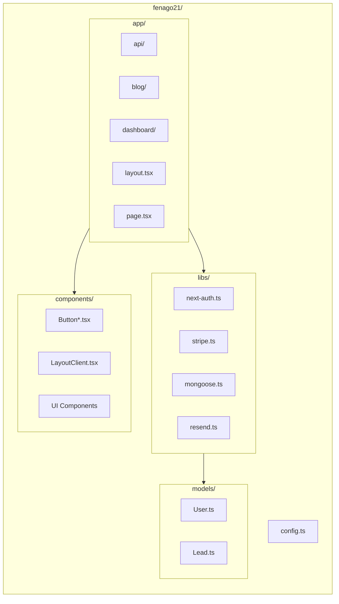
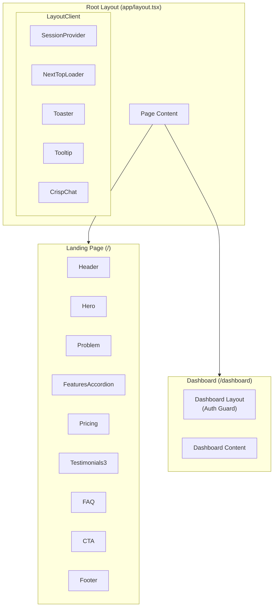
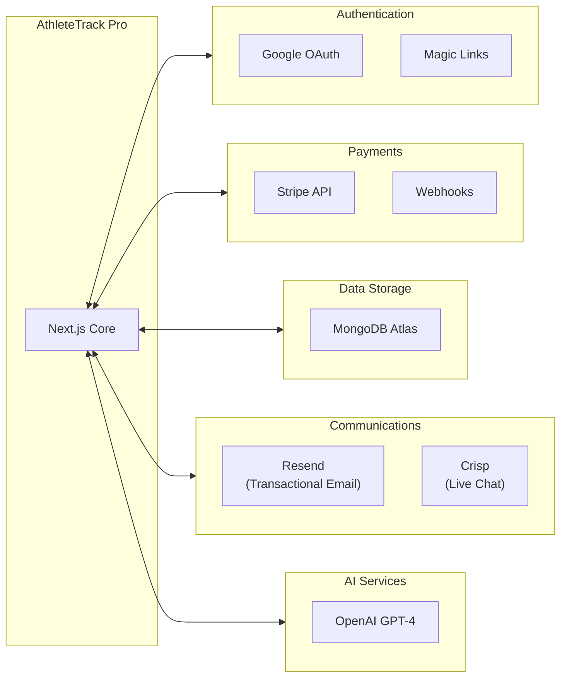
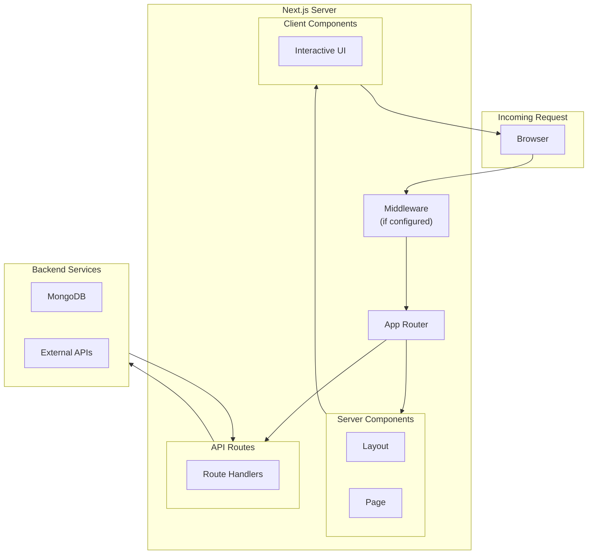

# AthleteTrack Pro (FeNAgO) - Architecture Diagram

## High-Level System Architecture

## Authentication Flow

## Payment Flow

## Data Model

## Directory Structure

## Component Hierarchy

## External Services Integration

## Request/Response Flow

---

## Technology Stack Summary

| Layer | Technology |
|-------|------------|
| **Framework** | Next.js 14.1.4 (App Router) |
| **Frontend** | React 18.2.0, TypeScript |
| **Styling** | Tailwind CSS 3.4.3, DaisyUI 4.10.1 |
| **Database** | MongoDB Atlas + Mongoose 7.6.10 |
| **Auth** | NextAuth.js 4.24.7 |
| **Payments** | Stripe 13.11.0 |
| **Email** | Resend 4.0.1 |
| **AI** | OpenAI GPT-4 |
| **Support** | Crisp Chat |

---

*Generated: January 2026*
